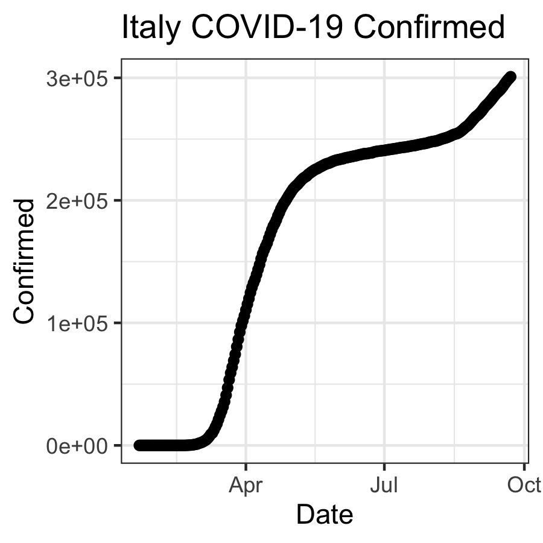

```{r}
library(tidyverse)
library(lubridate)
```


```{r}
time_series_confirmed_long <- read_csv(url("https://raw.githubusercontent.com/CSSEGISandData/COVID-19/master/csse_covid_19_data/csse_covid_19_time_series/time_series_covid19_confirmed_global.csv")) %>%
  rename(Province_State = "Province/State", Country_Region = "Country/Region")  %>% 
               pivot_longer(-c(Province_State, Country_Region, Lat, Long),
                             names_to = "Date", values_to = "Confirmed")
```


```{r}
# times series data for deaths
time_series_deaths_long <- read_csv(url("https://raw.githubusercontent.com/CSSEGISandData/COVID-19/master/csse_covid_19_data/csse_covid_19_time_series/time_series_covid19_deaths_global.csv")) %>%
  rename(Province_State = "Province/State", Country_Region = "Country/Region")  %>% 
  pivot_longer(-c(Province_State, Country_Region, Lat, Long),
               names_to = "Date", values_to = "Deaths")
```


```{r}
# Create Keys 
time_series_confirmed_long <- time_series_confirmed_long %>% 
  unite(Key, Province_State, Country_Region, Date, sep = ".", remove = FALSE)
time_series_deaths_long <- time_series_deaths_long %>% 
  unite(Key, Province_State, Country_Region, Date, sep = ".") %>% 
  select(Key, Deaths)
```


```{r}
# Join tables
time_series_long_joined <- full_join(time_series_confirmed_long,
    time_series_deaths_long, by = c("Key")) %>% 
    select(-Key)
```


```{r}
# Reformat the data
time_series_long_joined$Date <- mdy(time_series_long_joined$Date)
```


```{r}
# Create Report table with counts
time_series_long_joined_counts <- time_series_long_joined %>% 
  pivot_longer(-c(Province_State, Country_Region, Lat, Long, Date),
               names_to = "Report_Type", values_to = "Counts")
```

## Graphic Output
```{r}
# Plot graph to a png outputfile
ppi <- 300
png("images/us_deaths.png", width=6*ppi, height=6*ppi, res=ppi)
time_series_long_joined %>% 
  group_by(Country_Region,Date) %>% 
  summarise_at(c("Confirmed", "Deaths"), sum) %>% 
  filter (Country_Region == "US") %>% 
    ggplot(aes(x = Date,  y = Deaths)) + 
    geom_point() +
    geom_line() +
    ggtitle("US COVID-19 Deaths")
dev.off()
```
 

## Interactive graphs
```{r}
library(plotly)
US_deaths <- time_series_long_joined %>% 
    group_by(Country_Region,Date) %>% 
    summarise_at(c("Confirmed", "Deaths"), sum) %>% 
  #filtered by Country US and deaths  
  filter (Country_Region == "US")
 p <- ggplot(data = US_deaths, aes(x = Date,  y = Deaths)) + 
        geom_point() +
        geom_line() +
        ggtitle("US COVID-19 Deaths")
ggplotly(p)
```

## Animate Graphs with gganimate
```{r}
library(gganimate)
library(transformr)
theme_set(theme_bw())
```
```{r}
data_time <- time_series_long_joined %>% 
    group_by(Country_Region,Date) %>% 
    summarise_at(c("Confirmed", "Deaths"), sum) %>% 
  #plotting confirmed cases in China, South Korea, Japan, Italy, and the US  
  filter (Country_Region %in% c("China","Korea, South","Japan","Italy","US")) 
p <- ggplot(data_time, aes(x = Date,  y = Confirmed, color = Country_Region)) + 
      geom_point() +
      geom_line() +
      ggtitle("Confirmed COVID-19 Cases") +
      geom_point(aes(group = seq_along(Date))) +
      transition_reveal(Date) 
animate(p, end_pause = 15)
```


## Challenge 1
```{r}
ppi <- 300
png("images/italy_confirmed.png", width=3*ppi, height=3*ppi, res=ppi)
time_series_long_joined %>% 
  group_by(Country_Region,Date) %>% 
  summarise_at(c("Confirmed", "Deaths"), sum) %>% 
  #filter country by Italy and the confirmed cases
  filter (Country_Region == "Italy") %>% 
    ggplot(aes(x = Date,  y = Confirmed)) + 
    geom_point() +
    geom_line() +
    ggtitle("Italy COVID-19 Confirmed")
dev.off()
```
 

## Challenge 2
```{r}
z <- time_series_long_joined %>% 
    group_by(Country_Region,Date) %>% 
    summarise_at(c("Confirmed", "Deaths"), sum) %>% 
    filter (Country_Region %in% c("US", "Brazil", "United Kingdom", "Italy", "Mexico", "France", "Spain", "India", "Iran", "Peru")) %>% 
    ggplot(aes(x = Date,  y = Deaths, color = Country_Region)) + 
    geom_point() +
    geom_line() +
    ggtitle("COVID-19 Deaths")
ggplotly(z)
```

## Challenge 3
```{r}
z <- time_series_long_joined %>% 
    group_by(Country_Region,Date) %>% 
    summarise_at(c("Confirmed", "Deaths"), sum) %>% 
    filter (Country_Region %in% c("US", "Brazil", "United Kingdom", "Italy", "Mexico", "France", "Spain", "India", "Iran", "Peru"))
p <- ggplot(z, aes(x = Date,  y = Deaths, color = Country_Region)) + 
    geom_point() +
    geom_line() +
    ggtitle("COVID-19 Deaths")+
  geom_point(aes(group=seq_along(Date)))+
  transition_reveal(Date)
animate(p, end_pause = 15)
```


