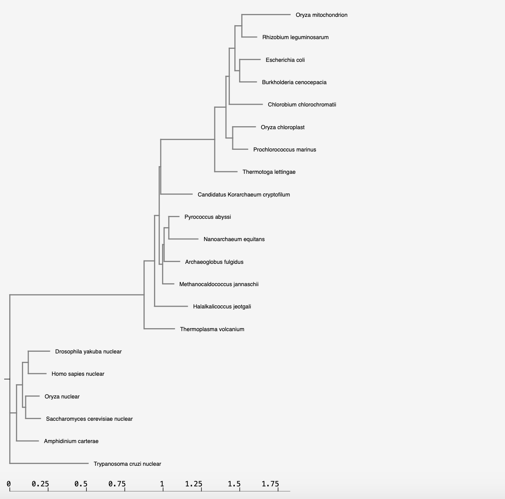

## 1. Tree from NGPhylogeny.fr analysis



## 2. fastree_result.tre

(Archaeoglobus_fulgidus:0.079342541,(((Trypanosoma_cruzi_nuclear:0.334821922,(Amphidinium_carterae:0.135702072,((Saccharomyces_cerevisiae_nuclear:0.108016655,(Homo_sapies_nuclear:0.116662039,Drosophila_yakuba_nuclear:0.182677295)1.000:0.065531216)0.962:0.034866729,Oryza_nuclear:0.095904385)0.973:0.058442973)0.988:0.116098814)1.000:0.490656942,(Thermotoga_lettingae_:0.114942788,(Chlorobium_chlorochromatii:0.201217151,((Prochlorococcus_marinus:0.086488477,Oryza_chloroplast:0.123539620)1.000:0.053843599,((Burkholderia_cenocepacia_:0.101474077,Escherichia_coli_:0.124502705)0.996:0.046671183,(Rhizobium_leguminosarum:0.065112748,Oryza_mitochondrion:0.251737977)0.985:0.045037580)1.000:0.062046047)0.811:0.036082232)0.996:0.082321971)1.000:0.243617424)0.896:0.056797217,Candidatus_Korarchaeum_cryptofilum_:0.127770843)0.999:0.070964468,((Thermoplasma_volcanium:0.195831131,Halalkalicoccus_jeotgali:0.186332517)1.000:0.055512652,((Nanoarchaeum_equitans:0.177761182,Pyrococcus_abyssi:0.049999408)0.999:0.042947805,Methanocaldococcus_jannaschii:0.064772938)0.963:0.018724462)0.460:0.009393561);


## 3. ggtree tutorial
```{r}
library(tidyverse)
library(ggtree)
library(treeio)
library(ggimage)
```

### Reading data from the newick file
```{r}
tree <- read.tree("data/tree_newick.nwk")
tree
```

### Using geom_tree to create a ggplot
```{r}
ggplot(tree) + geom_tree() + theme_tree()
ggtree(tree)
```

### A scale is added to the x axis
```{r}
ggtree(tree) + geom_treescale()
ggtree(tree) + theme_tree2()
```
### Dsiable scaling for a cladogram
```{r}
ggtree(tree, branch.length="none")
```

## Exercise 1

### 1.
```{r}
ggtree(tree, layout="slanted")
```

### 2.
```{r}
ggtree(tree, layout = "circular")
```

### 3.
```{r}
ggtree(tree, branch.length = "none", color = "red", size=2)
```

## Exercise 2
```{r}
p <- ggtree(tree)
p + geom_nodepoint(color = "yellow", alpha = 0.75)+
  geom_tippoint(color = "purple", shape = 18)+
  geom_tiplab(color = "purple")+
  ggtitle("Tree")
```

### Numbering the internal nodes
```{r}
ggtree(tree) + geom_text(aes(label=node), hjust=-.3)
```

## Exercise 3

### 1. Finding the MRCA
```{r}
MRCA(tree, c('B', 'C'))
MRCA(tree, c('L', 'J'))
```

### 2. Drawing the tree
```{r}
ggtree(tree)
```

### 3. Adding the tip labels
```{r}
ggtree(tree) + geom_tiplab()
```

```{r}
ggtree(tree) + geom_tiplab()+
  geom_highlight(node=17, fill = "blue")+
  geom_highlight(node=21, fill = "pink")+
  geom_highlight(node=23, fill = "purple")
```

### 5. Adding a clade label
```{r}
ggtree(tree) + geom_tiplab()+
  geom_highlight(node=17, fill = "blue")+
  geom_highlight(node=21, fill = "pink")+
  geom_highlight(node=23, fill = "purple")+
  geom_cladelabel(node=17, label="a clade", 
                  color="red2", offset=.8)
```

### 6. Linking the taxa
```{r}
ggtree(tree) + geom_tiplab()+
  geom_highlight(node=17, fill = "blue")+
  geom_highlight(node=21, fill = "pink")+
  geom_highlight(node=23, fill = "purple")+
  geom_cladelabel(node=17, label="a clade", 
                  color="red2", offset=.8)+
  geom_taxalink("C", "E", linetype=2,color="grey")+
  geom_taxalink("G", "J", linetype=2,color="grey")

```

### 7. Adding a scale bar
```{r}
ggtree(tree) + geom_tiplab()+
  geom_highlight(node=17, fill = "blue")+
  geom_highlight(node=21, fill = "pink")+
  geom_highlight(node=23, fill = "purple")+
  geom_cladelabel(node=17, label="a clade", 
                  color="red2", offset=.8)+
  geom_taxalink("C", "E", linetype=2,color="grey")+
  geom_taxalink("G", "J", linetype=2,color="grey")+
  theme_tree2()
```

### 8. Adding a title
```{r}
ggtree(tree) + geom_tiplab()+
  geom_highlight(node=17, fill = "blue")+
  geom_highlight(node=21, fill = "pink")+
  geom_highlight(node=23, fill = "purple")+
  geom_cladelabel(node=17, label="a clade", 
                  color="red2", offset=.8)+
  geom_taxalink("C", "E", linetype=2,color="grey")+
  geom_taxalink("G", "J", linetype=2,color="grey")+
  theme_tree2()+
  ggtitle("Tree")
```


### 8. Making the tree circular
```{r}
ggtree(tree, layout = "circular") + geom_tiplab()+
  geom_highlight(node=17, fill = "blue")+
  geom_highlight(node=21, fill = "pink")+
  geom_highlight(node=23, fill = "purple")+
  geom_cladelabel(node=17, label="a clade", 
                  color="red2", offset=.8)+
  ggtitle("Circular Tree")
```

## 4. FastTreeMP output
```{r}
tol <- read.tree("data/fastree_result.tre")
tol
```

```{r, fig.height=9, fig.width=9}
ggtree(tol, layout="circular")+
  geom_tiplab(offset = .5)+
  geom_text(aes(label=node), hjust=-.3)+
  geom_highlight(node=30, fill = "blue")+
  geom_highlight(node=25, fill = "pink")+
  geom_highlight(node=37, fill = "purple")
```

